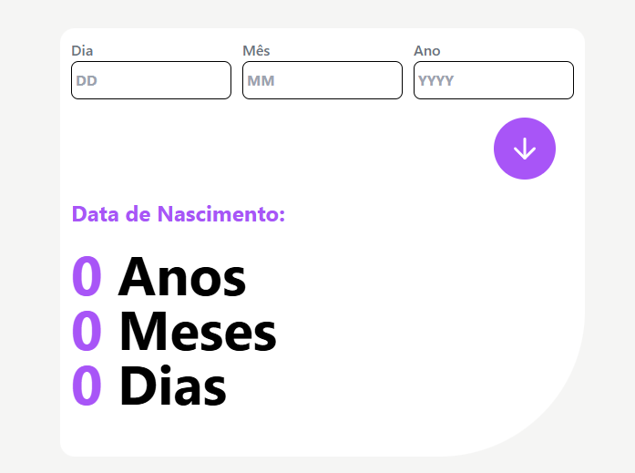
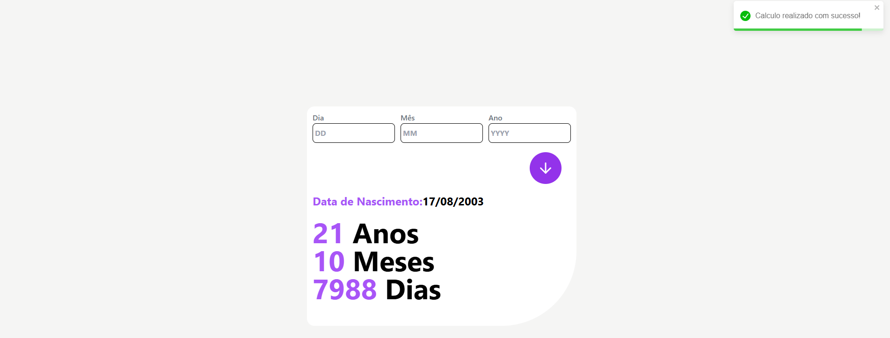
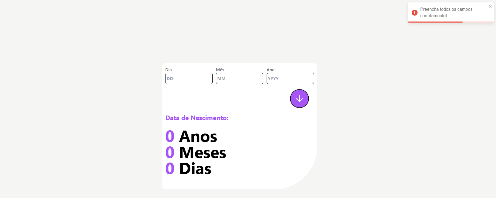

# Calculadora de Idade



## Descrição

A Calculadora de Idade é uma aplicação web que permite calcular a idade de uma pessoa com base na data de nascimento fornecida.

## Tecnologias e Dependências

- React
- Node.js
- Vite
- Tailwind
- react-toastify

## Instalação

Para instalar a Calculadora de Idade, siga os passos abaixo:

1. Clone o repositório:

```bash
git clone https://github.com/kevenklynsman/age-calculator-app
```

2. Instale as dependências:

```bash
cd calculadora-de-idade
npm install
```

3. Inicie a aplicação:

```bash
npm start
```     

## Pré-requisitos

- Node.js
- NPM

## Imagens






## Contato 

- GitHub: [kevenklynsman](https://github.com/kevenklynsman)
- LinkedIn: [kevenklynsman](https://www.linkedin.com/in/kevenklynsman/)
- E-mail: [kevenklynsman2003@gmail.com](mailto:kevenklynsman2003@gmailcom)