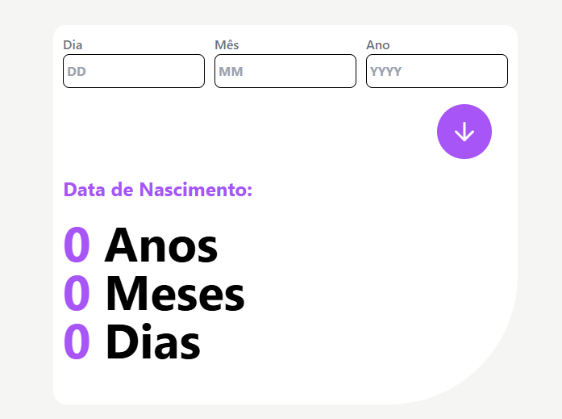
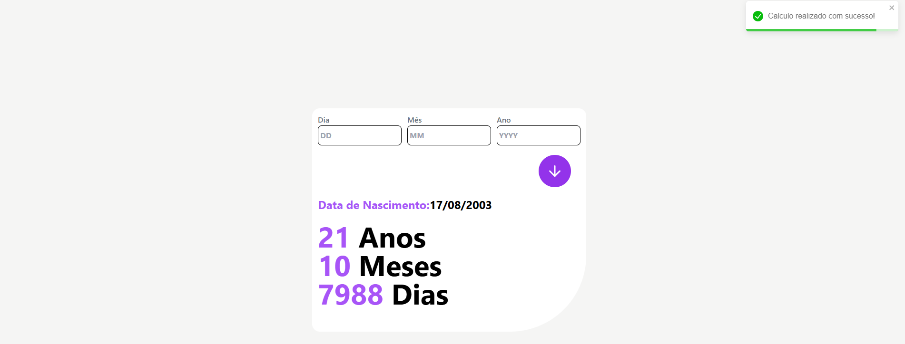
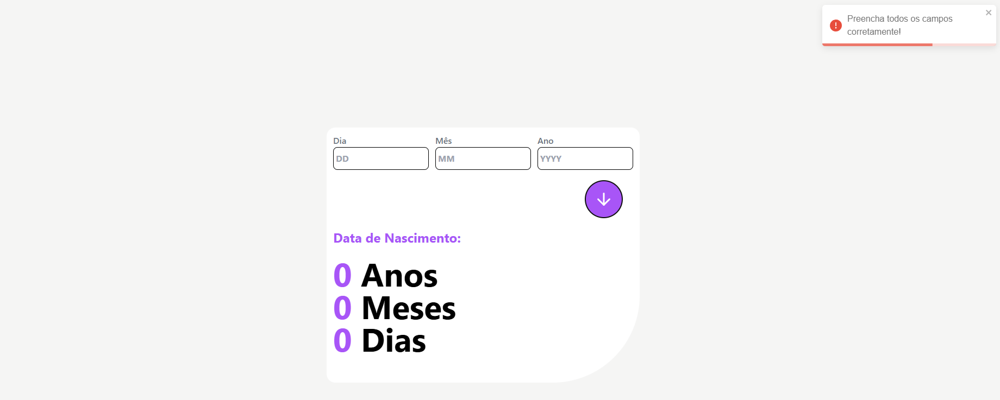

# Calculadora de Idade

Aplicação web para calcular idade a partir da data de nascimento, exibindo **anos, meses e dias** de forma clara e rápida.

Projeto construído com React + Vite, inspirado no desafio do Frontend Mentor, com foco em boa experiência de uso e código limpo.



---

## Sumário

- [Visão geral](#visão-geral)
- [Funcionalidades](#funcionalidades)
- [Tecnologias utilizadas](#tecnologias-utilizadas)
- [Arquitetura e organização](#arquitetura-e-organização)
- [Como executar o projeto](#como-executar-o-projeto)
- [Scripts disponíveis](#scripts-disponíveis)
- [Regras de validação](#regras-de-validação)
- [Build e deploy](#build-e-deploy)
- [Possíveis melhorias futuras](#possíveis-melhorias-futuras)
- [Contato](#contato)

---

## Visão geral

A Calculadora de Idade recebe dia, mês e ano de nascimento, valida os dados informados e retorna a idade formatada em:

- Anos
- Meses
- Dias

Além disso, o projeto apresenta notificações de sucesso/erro para orientar o usuário durante o cálculo.

---

## Funcionalidades

- Entrada de data com sanitização numérica.
- Validação de campos obrigatórios.
- Validação de data inválida (ex.: 31/02).
- Bloqueio de datas futuras.
- Exibição de idade calculada em anos, meses e dias.
- Exibição da data de nascimento formatada (`dd/MM/yyyy`).
- Feedback visual com toasts (sucesso e erro).

---

## Tecnologias utilizadas

### Core

- **React 18**: construção da interface e gerenciamento de estado.
- **Vite**: ambiente de desenvolvimento e build rápido.
- **JavaScript (ESM)**: linguagem principal do projeto.

### UI/UX

- **Tailwind CSS**: estilização utilitária e responsiva.
- **react-icons**: ícones para a interface.
- **react-toastify**: notificações de feedback para o usuário.

### Datas

- **date-fns**: cálculos e formatação de data.

### Qualidade e ferramentas

- **ESLint**: padronização e qualidade de código.
- **PostCSS + Autoprefixer**: processamento de CSS.

---

## Arquitetura e organização

Estrutura principal:

```text
.
├── public/
├── src/
│   ├── App.jsx
│   ├── age-calculator.jsx
│   ├── index.css
│   ├── main.jsx
│   └── utils/
│       └── ageCalculatorUtils.js
├── index.html
├── package.json
└── vite.config.js
```

### Responsabilidades por camada

- **Componente (`src/age-calculator.jsx`)**
	- Renderização da UI.
	- Estado dos campos e resultado.
	- Orquestração do fluxo de cálculo.

- **Utilitários (`src/utils/ageCalculatorUtils.js`)**
	- Sanitização dos inputs.
	- Validação e parsing da data de nascimento.
	- Cálculo de idade.
	- Formatação da data.

Esse desenho melhora legibilidade, manutenção e testes, seguindo princípios de **Clean Code** e **responsabilidade única (SRP)**.

---

## Como executar o projeto

### Pré-requisitos

- Node.js instalado.
- npm (ou pnpm) instalado.

> Recomendado: usar versão atual LTS do Node.js.

### 1) Clonar o repositório

```bash
git clone https://github.com/kevenklynsman/age-calculator-app.git
cd age-calculator-app
```

### 2) Instalar dependências

Com npm:

```bash
npm install
```

Ou com pnpm:

```bash
pnpm install
```

### 3) Rodar em desenvolvimento

Com npm:

```bash
npm run dev
```

Ou com pnpm:

```bash
pnpm dev
```

Depois, abra a URL mostrada no terminal (normalmente `http://localhost:5173`).

---

## Scripts disponíveis

No `package.json`:

- `npm run dev` → inicia servidor de desenvolvimento.
- `npm run build` → gera build de produção.
- `npm run preview` → serve localmente o build gerado.
- `npm run lint` → executa análise de lint.

---

## Regras de validação

O projeto aplica validações para garantir um cálculo confiável:

1. Todos os campos (dia, mês, ano) devem ser preenchidos.
2. Somente números são aceitos nos inputs.
3. Dia deve estar entre 1 e 31.
4. Mês deve estar entre 1 e 12.
5. Ano deve ser válido e não futuro.
6. A data completa deve existir no calendário.
7. Datas futuras são rejeitadas.

Quando alguma regra falha, o usuário recebe feedback por toast.

---

## Build e deploy

Para gerar versão de produção:

```bash
npm run build
```

Os arquivos otimizados serão gerados na pasta `dist/`.

Para testar o build localmente:

```bash
npm run preview
```

---

## Possíveis melhorias futuras

- Adicionar testes unitários para utilitários de data e validação.
- Adicionar testes de interface (fluxo principal do usuário).
- Internacionalização de idioma (i18n).
- Melhorias de acessibilidade (ARIA e navegação por teclado).
- Máscara visual de input mantendo a sanitização atual.

---

## Imagens





---

## Contato

- GitHub: [kevenklynsman](https://github.com/kevenklynsman)
- LinkedIn: [kevenklynsman](https://www.linkedin.com/in/kevenklynsman/)
- E-mail: [kevenklynsman2003@gmail.com](mailto:kevenklynsman2003@gmail.com)